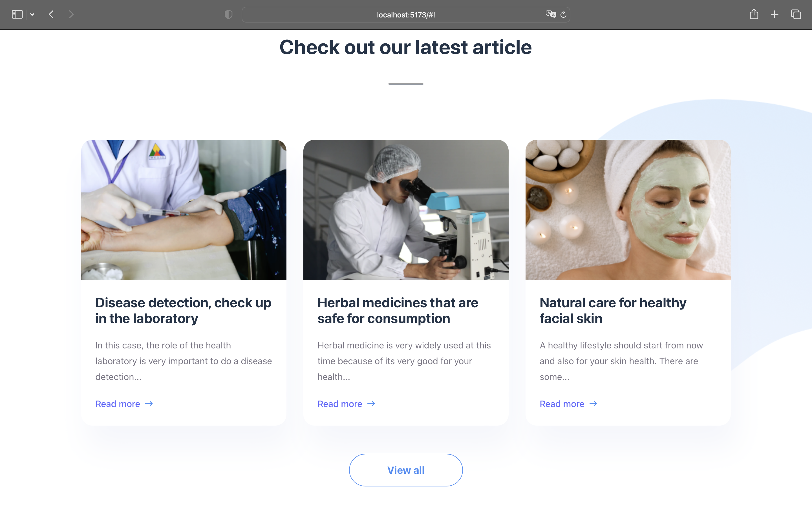

# Health App Screen for Effective. Lab №1, Web.

## How to run

* Clone this project
* Run Terminal and enter commands:
**cd react-lab1**
**npm install**
**npm run dev**
* Go to http://localhost:5173/ in Browser

## Versions

* npm ver. 9.8.1
* React ver. 18.2.0 
* Typescript ver. Typescript ver. 5.3.3

## Screenshots app
|                                Screenshots                              |
|:-----------------------------------------------------------------------:|
|    | 
|   |
|    | 
|   |
|    | 
|    |
|  | 

## Github pages
* Add later